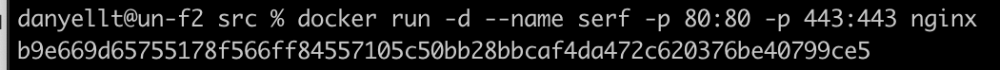
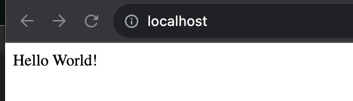

## Simple Docker

## Part 1. Готовый докер

1. Взять официальный докер образ с nginx и выкачать его при помощи docker pull

2. Проверить наличие докер образа через docker images

3. Запустить докер образ через docker run -d [image_id|repository]

4. Проверить, что образ запустился через docker ps

5. Посмотреть информацию о контейнере через docker inspect [container_id|container_name]

6. По выводу команды определить и поместить в отчёт размер контейнера, список замапленных портов и ip контейнера

Размер:

Список замапленных портов:

Ip контейнера:

7. Остановить докер образ через docker stop [container_id|container_name]

8. Проверить, что образ остановился через docker ps

9. Запустить докер с портами 80 и 443 в контейнере, замапленными на такие же порты на локальной машине, через команду run

10. Проверить, что в браузере по адресу localhost:80 доступна стартовая страница nginx

11. Проверить любым способом, что контейнер запустился

## Part 2. Операции с контейнером

1. Прочитать конфигурационный файл nginx.conf внутри докер контейнера через команду exec

2. Создать на локальной машине файл nginx.conf

3. Настроить в нем по пути /status отдачу страницы статуса сервера nginx

4. Скопировать созданный файл nginx.conf внутрь докер образа через команду docker cp

5. Перезапустить nginx внутри докер образа через команду exec

6. Проверить, что по адресу localhost:80/status отдается страничка со статусом сервера nginx

7. Экспортировать контейнер в файл container.tar через команду export

8. Остановить контейнер

9. Удалить образ через docker rmi [image_id|repository], не удаляя перед этим контейнеры

10. Удалить остановленный контейнер

11. Импортировать контейнер обратно через команду import

12. Запустить импортированный контейнер

13. Проверить, что по адресу localhost:80/status отдается страничка со статусом сервера nginx

## Part 3. Мини веб-сервер

1. Написать мини сервер на C и FastCgi, который будет возвращать простейшую страничку с надписью Hello World!

2. Написать свой nginx.conf, который будет проксировать все запросы с 81 порта на 127.0.0.1:8080

3. Скопировали созданный nginx.conf и мини сервер в контейнер и зашли в него

4. Установили требуемые ПО

5. Скомпилировали и запустили написанный мини сервер через spawn-fcgi на порту 8080

6. Проверили, что в браузере по localhost:81 отдается написанная вами страничка

## Part 4. Свой докер

1. Написать свой докер образ, который:
1) собирает исходники мини сервера на FastCgi из Части 3
2) запускает его на 8080 порту
3) копирует внутрь образа написанный ./nginx/nginx.conf
4) запускает nginx.

2. Собрать написанный докер образ через docker build при этом указав имя и тег

3. Проверить через docker images, что все собралось корректно

4. Запустить собранный докер образ с маппингом 81 порта на 80 на локальной машине и маппингом папки ./nginx внутрь контейнера по адресу, где лежат конфигурационные файлы nginx'а 

5. Проверить, что по localhost:80 доступна страничка написанного мини сервера

6. Дописать в ./nginx/nginx.conf проксирование странички /status, по которой надо отдавать статус сервера nginx

7. Перезапустить докер образ

7. Проверить, что теперь по localhost:80/status отдается страничка со статусом nginx

## Part 5. Dockle

1. Просканировать образ из предыдущего задания через dockle [image_id|repository]

2. Исправить образ так, чтобы при проверке через dockle не было ошибок и предупреждений

## Part 6. Базовый Docker Compose

1. Написать файл docker-compose.yml, с помощью которого:

1) Поднять докер контейнер из Части 5 (он должен работать в локальной сети, т.е. не нужно использовать инструкцию EXPOSE и мапить порты на локальную машину)
2) Поднять докер контейнер с nginx, который будет проксировать все запросы с 8080 порта на 81 порт первого контейнера
2. Замапить 8080 порт второго контейнера на 80 порт локальной машины

3. Остановить все запущенные контейнеры

4. Собрать и запустить проект с помощью команд docker-compose build и docker-compose up

5. Проверить, что в браузере по localhost:80 отдается написанная вами страничка, как и ранее

